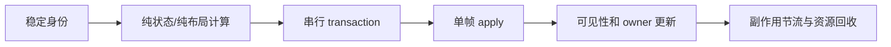

# Telegram iOS 架构学习与 Ibili 改造建议

> 文档类型：架构调研 / 改造路线图  
> 调研日期：2026-07-17  
> Telegram 源码：`/Users/lxy/Downloads/code/telegram`  
> 调研分支：`local/relay-ios`，提交 `803e8b015b`  
> Ibili 源码：`/Users/lxy/Downloads/code/Ibili`

## 1. 结论摘要

Telegram iOS 的流畅并不来自某个单独组件，而来自一组贯穿数据、布局、渲染、动画和生命周期的约束：

1. 大列表不依赖 SwiftUI 的隐式 diff 和视图生命周期，而是使用自建虚拟化列表，只维护可见区附近的节点。
2. 昂贵布局先在后台计算，主线程只提交已经计算好的 frame、layer 和状态。
3. 所有列表变更先生成稳定 ID diff，再通过串行 transaction 提交，避免交叉更新和动画抢占。
4. “可见”不等于“立刻做所有工作”。已读、预取、媒体刷新、翻译等副作用被批量、节流、按滚动方向调度。
5. 搜索不是一个会替换当前根 tab 的新世界，而是当前 controller 的一个展示状态；底栏、搜索框、键盘和导航栏由同一次 transition 驱动。
6. 视频内容由稳定媒体 ID 管理，页面、浮窗、画中画、gallery 只是不同优先级的 subscriber。播放器内容只有一个 owner，展示外壳与播放内核分离。

Ibili 不应直接复制 Telegram 的 `ListView`、AsyncDisplayKit 或自研播放器内核。更合理的迁移方向是：

- 信息流：先把纯计算、富文本解析和副作用移出 SwiftUI `body`，再为首页和评论区建立基于 `UICollectionView` 的热点列表层。
- 搜索：把 `.search` 从“第四个内容 tab”改造成根 tab chrome 的显式展示状态，关闭搜索时不改变原内容 tab。
- 播放器：保留 `AVPlayerViewController`，借鉴 Telegram 的内容身份、owner/lease、surface priority 和 decoration 分层。
- iPad：详情侧栏必须由稳定的双栏容器统一管理几何和转场，不能在点击视频后临时重建根布局、重排首页网格并同时初始化播放器。

## 2. 调研范围与边界

本次重点阅读了以下代码链：

### 2.1 信息流

- `telegram/submodules/Display/Source/ListView.swift`
- `telegram/submodules/Display/Source/ListViewItem.swift`
- `telegram/submodules/Display/Source/ListViewItemNode.swift`
- `telegram/submodules/Display/Source/ListViewTransactionQueue.swift`
- `telegram/submodules/Display/Source/ListViewIntermediateState.swift`
- `telegram/submodules/TelegramUI/Sources/PreparedChatHistoryViewTransition.swift`
- `telegram/submodules/TelegramUI/Sources/ChatHistoryListNode.swift`
- `telegram/submodules/TelegramUI/Components/Chat/ChatMessageItemImpl/Sources/ChatMessageItemImpl.swift`
- `telegram/submodules/TelegramUI/Sources/ChatMessageThrottledProcessingManager.swift`
- `telegram/submodules/TelegramUI/Sources/InChatPrefetchManager.swift`

### 2.2 底部搜索

- `telegram/submodules/Display/Source/ViewController.swift`
- `telegram/submodules/TabBarUI/Sources/TabBarController.swift`
- `telegram/submodules/TabBarUI/Sources/TabBarContollerNode.swift`
- `telegram/submodules/TelegramUI/Components/TabBarComponent/Sources/TabBarComponent.swift`
- `telegram/submodules/ChatListUI/Sources/ChatListController.swift`

### 2.3 视频播放

- `telegram/submodules/AccountContext/Sources/UniversalVideoNode.swift`
- `telegram/submodules/TelegramUniversalVideoContent/Sources/UniversalVideoContentManager.swift`
- `telegram/submodules/TelegramUniversalVideoContent/Sources/NativeVideoContent.swift`
- `telegram/submodules/TelegramUniversalVideoContent/Sources/SystemVideoContent.swift`
- `telegram/submodules/TelegramUniversalVideoContent/Sources/OverlayUniversalVideoNode.swift`
- `telegram/submodules/MediaPlayer/Sources/MediaPlayer.swift`
- `telegram/submodules/MediaPlayer/Sources/MediaPlayerNode.swift`

### 2.4 iPad master-detail 容器

- `telegram/submodules/Display/Source/Navigation/NavigationController.swift`
- `telegram/submodules/Display/Source/Navigation/NavigationLayout.swift`
- `telegram/submodules/Display/Source/Navigation/NavigationSplitContainer.swift`
- `telegram/submodules/TelegramUI/Sources/TelegramRootController.swift`

Telegram 仓库 README 明确要求使用者遵守其许可证并发布相应代码。本文只总结架构模式，不建议直接复制 Telegram 源文件或大段实现进入 Ibili。

## 3. 信息流：Telegram 为什么能承载大量内容

### 3.1 它不是普通的 UITableView，也不是 SwiftUI Lazy 容器

Telegram 的 `ListViewImpl` 自己管理一个滚动器和一组 `ListViewItemNode`。数据源可以很大，但实际节点数量只覆盖可见区域和一个受控的不可见缓冲区。

`ListView` 默认缓冲区为 500 点，关闭页面预加载后缩小为 20 点：

- `ListView.swift:224-232`
- `ChatHistoryListNode.swift:1011` 将聊天列表的 `preloadPages` 设为 `false`

节点超出 `visibleSize + invisibleInset` 后会被主动移除：

- `ListViewIntermediateState.swift:615-675`

这和 SwiftUI `LazyVStack` 的主要区别不是“是否懒加载”，而是 Telegram 对以下行为拥有确定控制：

- 具体保留多少屏外节点。
- 什么时候创建节点。
- 什么时候移除节点。
- 哪些更新可以复用现有节点。
- 哪一帧把更新提交到屏幕。

### 3.2 布局计算与 UI 提交被明确拆开

`ListViewItem` 的接口不是直接返回一个已经完成布局的 view，而是分成两步：

```swift
func nodeConfiguredForParams(async: ..., completion: ...)
func updateNode(async: ..., node: ..., completion: ...)
```

对应位置：`ListViewItem.swift:72-83`。

列表默认把布局工作派发到 `userInteractive` 全局队列：`ListView.swift:1753-1762`。布局完成后才回到主线程 apply。

聊天消息的实现进一步体现了这个模式：

1. 选择消息对应的节点类型。
2. 调用节点的 `asyncLayout()` 生成纯布局函数。
3. 在后台计算文字、媒体、邻接关系和最终尺寸。
4. 回到主线程应用 frame、内容和动画。

关键位置：`ChatMessageItemImpl.swift:493-690`。

因此滚动帧内不需要重新执行整棵声明式 view tree，也尽量不做富文本解析、图片布局和正则扫描。

### 3.3 数据变化先做稳定 diff，再进入串行 transaction

聊天历史更新先通过 `mergeListsStableWithUpdates` 计算删除、插入和更新：

- `PreparedChatHistoryViewTransition.swift:11-20`

之后再映射成 `ListViewDeleteItem`、`ListViewInsertItem` 和 `ListViewUpdateItem`。初始加载、交互插入、reload、hole reload 使用不同选项，不会把所有变化都当作全量刷新。

`ListViewTransactionQueue` 保证 transaction 串行执行。新的更新不会在上一个布局/apply 尚未结束时强行交叉提交。

可见节点更新还会在 VSync 时提交：`ListView.swift:4606-4668`。这减少了“数据刚变化就立即在任意 run-loop 时点改 UI”的抖动。

### 3.4 它将“节点预加载”和“媒体预取”分开

Telegram 聊天列表关闭了较大的节点预加载，但另有 `InChatPrefetchManager` 负责媒体预取。

媒体预取具有以下特点：

- 只维护当前滚动方向前方的媒体集合。
- 网络、会话类型和自动下载设置共同决定是否预取。
- 新集合到来后取消不再有效的任务。
- 视频只预加载有限时长，而不是无边界下载。

关键位置：

- `ChatHistoryListNode.swift:1020-1050`
- `ChatHistoryListNode.swift:3250-3300`
- `InChatPrefetchManager.swift:35-155`

这比“每个 cell onAppear 后预取后面固定 N 个资源”更可控。

### 3.5 可见副作用被批量和节流

Telegram 对已读、反应、翻译、扩展媒体、故事刷新等动作使用独立 processing manager。

`ChatMessageThrottledProcessingManager` 会先把消息 ID 放入集合，延迟后一次性处理；还支持同一消息的最小重复提交间隔。见 `ChatMessageThrottledProcessingManager.swift:6-74`。

它解决了一个常见问题：快速滑动时，几十个 item 的 `onAppear`/`onDisappear` 不应该立即触发几十次数据库、网络或状态发布。

### 3.6 媒体是否工作由 visibility 驱动

Telegram 的 `MediaPlayerNode` 只在内容位于层级中，或显式允许后台播放时请求视频帧。播放器收到 visibility 变化后决定播放或暂停。

相关位置：

- `MediaPlayer.swift:185` 附近的 `visibilityUpdated`
- `MediaPlayerNode.swift:67-68`
- `MediaPlayerNode.swift:438-445`

这避免了屏外视频、动画和计时器继续占用解码与合成资源。

## 4. Ibili 信息流改造前差距

### 4.1 改造前列表主要依赖 SwiftUI 隐式工作量

`PagedCollectionSurface` 使用 `LazyVStack` / `LazyVGrid`，并在每次 body 计算时构造 `Array(items.enumerated())`：

- `Ibili/PagedCollectionSurface.swift:42-76`

这套实现简单且语义清晰，但存在几个不可控点：

- 环境对象变化可能让大量可见卡片重新计算 body。
- 图片状态更新、菜单状态、主题设置可能扩大 SwiftUI diff 范围。
- item 的创建/移除缓冲区由 SwiftUI 决定。
- 分页和副作用绑定在行 `onAppear` 上。
- 大量异构内容时，布局和 diff 的成本难以预测。

### 4.2 首页本身是第一优先级的滚动热点

首页卡顿不能被归结为评论富文本问题。当前首页在一次连续滚动中同时承担了几类工作：

- `ScrollOffsetCollapseDriver` 在每个滚动帧写入 `headerCollapseProgress` 和 `scrollOffset`。前者一路绑定到 `HomeView`，可能让包含整个 feed 的父级视图参与重新求值。
- `HomeFeedPage` 的 `GeometryReader` 会重新解析列数、网格 metrics 和 `[GridItem]`。
- `PagedCollectionSurface` 每次求值都构造 `Array(items.enumerated())`。
- 每张 `VideoCardView` 都在 `body` 中重新构造 `MediaCardRenderModel`。
- 每张卡片都挂载独立的 overflow menu、overlay、clip shape、手势和 `RemoteImageLoader` 状态。
- item `onAppear` 会重新切片并复制周围的可见 item，再触发封面和 playurl 预取判断。
- 图片加载完成后通过 `@Published` 回到主线程更新；连续图片完成可能和滚动帧争抢主线程。

关键位置：

- `Ibili/HomeView.swift:48-223`
- `Ibili/PageChrome.swift:195-314`
- `Ibili/IbiliSegmentedTabs.swift:125-157`
- `Ibili/PagedCollectionSurface.swift:42-76`
- `Ibili/VideoCardView.swift:11-22`
- `Ibili/SharedViews.swift:74-169`

这意味着首页第一阶段不能只做“图片缓存”或“加 `.equatable()`”。需要先隔离逐帧 chrome 状态，确保标题折叠只更新标题和顶部背景；随后让 feed snapshot、cell layout、菜单和预取拥有明确的更新边界。

### 4.3 评论富文本正在滚动热路径中重复做纯计算

`RichReplyText.rendered` 每次 body 计算都会重新调用 `tokenize`：

- 构造 emote `Set`。
- 构造 jump dictionary。
- 对关键字按长度排序。
- 将整个字符串转成 `[Character]`。
- 对每个字符尝试匹配跳转关键字。
- 在 inline link 检测中重复创建 `NSRegularExpression`。

关键位置：`Ibili/RichReplyText.swift:116-184`。

这类工作应该在 DTO 转为 render model 时完成一次，而不是随着 SwiftUI body、图片加载或环境变化重复运行。

评论行还会读取整个 `AppSettings` 环境对象。任何评论设置变化都有可能让全部可见行重算。每行内部还有 truncation `@State` 和 emote task，进一步增加更新源。

### 4.4 当前预取仍以 item appear 为中心

首页通过可见 item 的 `onAppear` 更新可见集合和封面 lookahead；评论列表在 item 数量变化时预取末尾 24 个头像。

它们已经比完全无预取更好，但还缺少：

- 明确滚动方向。
- 快速拖动期间暂停低优先级预取。
- 停止滚动后再恢复富内容加载。
- 单独的资源预算和取消策略。
- 对“可见 UI”与“应执行副作用”的区分。

## 5. 信息流建议方案

### 5.0 当前实施状态（2026-07-17）

| 页面 | 当前列表层 | 已实施优化 | 后续边界 |
| --- | --- | --- | --- |
| 首页推荐 / 热门 | `UICollectionView` + diffable data source + 固定尺寸 UIKit cell | cell 复用、图片降采样、collection prefetch、稳定 ID snapshot、viewport 去重、滚动 chrome 隔离、系统栏 underlap | 继续用真机 Instruments 验证 120Hz；不再通过 SwiftUI 每帧重建列表 |
| 首页直播 | `LazyVGrid` / `PagedCollectionSurface` | 稳定索引、共享图片缓存、前向封面预取 | 视觉和交互保持成熟实现；确认首页 UIKit 试点稳定后再决定是否迁移 |
| 动态 | `LazyVStack` | 稳定索引、移除图片网格枚举数组拷贝、共享图片缓存和降采样 | 异构卡片和多种交互较多，不在没有基准数据时直接改成 UIKit |
| 搜索结果 | `LazyVGrid` | 稳定索引、封面预取从 O(n) 查找改为 O(1) 索引窗口、共享图片管线 | 搜索类型异构，后续可按视频结果先行试点 collection |
| 评论区 | 父页面 `ScrollView` 内的 `LazyVStack` | 头像预取、图片枚举无拷贝、富文本 segment 缓存、正则静态复用 | 不能在现有父滚动容器中直接嵌套 collection；迁移需先统一视频详情滚动所有权 |

这里的“优化覆盖”分为两层：共享热路径优化不等于 UIKit 列表迁移。当前只有首页推荐/热门使用完整的 collection 复用模型；其余页面优先消除已确认的重复计算和预取缺口，以避免为了性能破坏既有布局、导航和手势行为。

### 5.1 第一阶段：先让 SwiftUI 热路径变纯

在引入 UIKit 列表前，先完成以下调整：

1. 将标题折叠状态限制在独立 chrome host 内，不让每帧 `scrollOffset` 写入使首页网格重新求值。
2. 由 `HomeViewModel` 生成并缓存 `[MediaCardRenderModel]`，设置变化时批量重建一次，不在每张卡片 `body` 内重复转换 DTO。
3. 新增 `CommentRenderModel` 缓存层，在 ViewModel 或后台 actor 中完成文本 token 化、链接识别、日期格式化和显示配置解析。
4. `RichReplyText` 接收已经解析好的 segment，不再自行扫描原字符串；正则表达式改为静态复用。
5. 卡片和评论行不再直接观察整个 `AppSettings`，改为接收小型、Equatable 的 appearance/config 值。
6. 将 `ForEach(Array(items.enumerated()))` 改成稳定索引/稳定 ID 数据结构，避免整数组复制。
7. 将 `onAppear` 副作用交给统一 viewport coordinator，批量、去重和节流；不要为每个可见 item 重复复制周围窗口。
8. 快速滚动期间只显示缓存内容，暂停非必要菜单准备、emote、图片和 playurl 预取。
9. 使用 signpost 验证顶部 Material/mask 是否造成 GPU hitch；没有证据时不随意删除系统材质。

这一阶段的目标不是追求极限性能，而是先让后续测量结果可解释。

### 5.2 第二阶段：首页建立 UICollectionView 热路径试点

不建议移植 Telegram `ListView`。Ibili 可以使用系统 `UICollectionView` 获得大部分收益：

- `UICollectionViewDiffableDataSource`：稳定 ID diff。
- `UICollectionViewCompositionalLayout` 或固定网格 layout：iPad 多列布局。
- 自定义 `UICollectionViewCell`：封面、标题、作者、角标使用 UIKit/layer 实现。
- 预计算固定卡片高度，避免 self-sizing 在滚动中反复测量。
- `UICollectionViewDataSourcePrefetching`：按 index path 和滚动方向管理图片预取。
- cell `prepareForReuse`：明确取消图片、菜单和观察任务。
- SwiftUI 只保留 `FeedChrome`、页面切换和根导航；列表作为 `UIViewControllerRepresentable` 嵌入。

首页试点应分成三个可独立对比的提交：

1. 先替换推荐 feed 的 collection/data source，不改卡片视觉。
2. 再把 `RemoteImage` 下沉为 cell 内图片管线和 `CALayer` 更新，确保图片完成只影响目标 cell。
3. 最后接入统一 viewport/prefetch coordinator，并将热门、搜索结果、历史记录迁移到同一套列表基础设施。

首页的分页 snapshot 必须只 append 新 ID；切换推荐/热门时使用独立 snapshot 和滚动位置，不应 reload 整个 collection。

不建议在第一版 UIKit 列表里使用 `UIHostingConfiguration` 渲染原 SwiftUI 卡片，因为它可能保留当前 body/diff 成本，无法验证 UIKit 化本身的收益。

### 5.3 第三阶段：评论区迁移到异构 UICollectionView

评论区比首页更复杂，适合在首页试点稳定后迁移：

- 文本、图片、预览回复分别形成预计算 layout model。
- 使用 TextKit/AttributedString 在后台测量文本。
- cell 主线程只应用已计算 frame。
- 回复点赞只更新目标 item，不发布整个评论数组。
- viewport coordinator 统一处理已读、头像、表情和分页。

### 5.4 iPad 侧边播放器需要稳定的容器级转场

当前 iPad 横屏根布局由 `router.pending != nil` 决定是否进入 split：

- 无详情时，`MainTabView` 占满全宽。
- 点击视频后，左栏宽度立即变成 split 宽度，而且明确关闭了动画。
- `DeepLinkSplitHost` 同时从右侧做 offset spring。
- 新建 `NavigationStack`、视频详情和 AVPlayer 初始化也发生在这段时间。
- 关闭时先单独把详情移出，延迟关闭 session，随后左侧网格再跳回全宽。

关键位置：`Ibili/RootView.swift:117-300`。这不是单纯调整 spring 参数能解决的问题，真正的成本是一次点击触发了根树切换、首页网格重排、详情构建和播放器启动。

Telegram 的 `NavigationController(mode: .automaticMasterDetail)` 把 master/detail 作为稳定容器。`NavigationSplitContainer` 持续拥有左右两个 `NavigationContainer`，同一个 `ContainedViewLayoutTransition` 更新 master frame、detail frame、分隔线和子 controller layout：

- `Telegram/Display/Navigation/NavigationController.swift:51-64`
- `Telegram/Display/Navigation/NavigationController.swift:986-1117`
- `Telegram/Display/Navigation/NavigationSplitContainer.swift:84-112`

Ibili 建议引入 `IPadContentContainer`，其职责仅限于双栏展示，不接管播放器生命周期：

1. 在 iPad regular landscape 中保持容器身份稳定，不根据 `pending` 条件性销毁/重建整个 split host。
2. 使用明确状态机：`idle -> presenting(route) -> presented(route) -> dismissing(route) -> idle`。
3. primary、detail、divider、遮罩和 toolbar geometry 由同一个可中断 transition 驱动，关闭动画直接反向执行。
4. detail host 在点击前已经存在；点击后只更新 route/snapshot，不在动画首帧创建新的导航世界。
5. 播放器 session 仍由现有 runtime coordinator 持有；侧栏只申请 presentation surface。
6. 优先采用持久的 `UISplitViewController` 或小型 UIKit container + `UIViewPropertyAnimator`，让 frame 动画和手势中断在一个 UIKit transaction 中完成。

产品层面有两种选择：

- **推荐**：iPad 横屏始终保持稳定双栏，未选内容时右栏显示轻量 placeholder。首页永远按 master 宽度布局，打开视频不再触发网格重排，这是最接近 Telegram 的方案。
- **保留当前全宽首页**：容器仍需常驻。进入详情时先用 feed snapshot/transform 完成视觉收缩，动画结束后只提交一次 collection layout；不能在每个动画帧让 `LazyVGrid` 或 collection 重新计算列数。

无论选择哪种方式，都不应给 `DeepLinkSplitHost` 整体增加 `.compositingGroup()` 来碰运气。AVPlayer、Material 和大面积离屏合成叠加时，反而可能增加老 iPad 的 GPU 带宽压力。

### 5.5 不建议做的事情

- 不引入整个 AsyncDisplayKit/Texture 依赖。
- 不复制 Telegram `ListView` 的五千行状态机。
- 不试图通过更多 `.drawingGroup`、`.equatable()` 或全局禁用动画掩盖结构问题。
- 不让首页和评论区分别发明两套预取与可见性语义。
- 不让 `router.pending` 直接决定整个 iPad 根视图树属于单栏还是双栏。

## 6. 底部搜索：Telegram 的状态模型

### 6.1 搜索是当前 controller 的模式，不是另一个内容 tab

Telegram 的 `ViewController` 暴露一个很小的状态：

```swift
struct TabBarSearchState {
    var isActive: Bool
}
```

当前 controller 通过 `updateTabBarSearchState` 把状态和 transition 一起上报给 tab bar。见 `Display/ViewController.swift:221-234`、`731-735`。

底栏搜索按钮调用当前 controller 的 `tabBarActivateSearch()` / `tabBarDeactivateSearch()`，不会先把 selected tab 改成一个 search tab。

### 6.2 激活和退出由同一次 transition 驱动

ChatList 激活搜索时：

1. 建立或复用 SearchDisplayController。
2. 隐藏当前导航栏。
3. 将 `TabBarSearchState` 设为 active。
4. 把底栏中的 `SearchBarNode` 交给搜索内容。
5. 激活键盘。

退出搜索时：

1. 先让 search display controller 退场。
2. 恢复导航栏。
3. 用同一个 spring transition 将 `TabBarSearchState` 设为 inactive。
4. 恢复 tab bar 形态。

关键位置：`ChatListController.swift:4580-4730`。

它还通过 0.6 秒 toggle 窗口防止激活/退出重入。

### 6.3 搜索栏和 tab 项始终属于同一个组件树

`TabBarComponent` 在 active/inactive 之间不会替换整个底栏：

- 普通 tab 项压缩到一个 48x48 区域。
- 非当前 tab 做 alpha + blur 过渡。
- 搜索按钮从圆形扩展成搜索输入区域。
- 关闭按钮从缩放 0.001 动画到 1。
- 退出完成后才移除搜索节点。

关键位置：`TabBarComponent.swift:850-945`。

因此不存在“先切回首页底栏，再把搜索页撤掉”的中间帧。

## 7. Ibili 搜索问题的结构性原因

Ibili 当前在 iOS 18+ 同时维护：

- `selectedTab: MainTab`
- `.search` 这个真实 tab value
- `isSearchPresented`
- SwiftUI 环境中的 `isSearching`
- `SearchViewModel.hasActiveSubmittedQuery`

关键位置：`Ibili/RootView.swift:1471-1666`。

其中 `updateSearchPresentation(for:)` 又根据 `selectedTab == .search` 推导 `isSearchPresented`。但提交搜索后会单独把 `isSearchPresented` 设为 false，selected tab 仍然是 `.search`。这使“内容 tab 选择”和“搜索框展示”形成两个相互矛盾的事实来源。

退出搜索时底栏闪到主页，很可能就是系统 `Tab(role: .search)`、selection binding 和手动 `isPresented` 写回在不同 run-loop/动画事务中产生了中间状态。

## 8. 搜索改造建议

### 8.1 建立唯一根状态

建议把内容 tab 和搜索展示分离：

```swift
enum ContentTab {
    case home
    case dynamic
    case profile
}

enum RootSearchPhase: Equatable {
    case inactive
    case activating(origin: ContentTab)
    case active(origin: ContentTab)
    case dismissing(origin: ContentTab)
}
```

搜索不再是业务意义上的第四个内容 tab。即便为了使用系统 `Tab(role: .search)` 仍保留系统 selection bridge，业务状态也只能由 `RootSearchPhase` 驱动，系统 selection 写回只是输入事件。

### 8.2 使用事件 reducer，禁止分散写状态

所有搜索变化只通过事件进入：

```swift
enum RootSearchEvent {
    case searchButtonTapped
    case systemPresentationChanged(Bool)
    case querySubmitted(String)
    case closeTapped
    case clearTapped
    case contentTabSelected(ContentTab)
}
```

reducer 一次性输出：

- 当前内容 tab。
- 搜索 phase。
- 键盘是否应激活。
- 是否显示 landing/results。
- 是否清空 query/submitted query。
- 使用的动画 transaction。

页面和 tab bar 不再直接互相修改状态。

### 8.3 关闭搜索的正确顺序

关闭搜索时应保持 origin tab 不变：

1. `phase = .dismissing(origin)`。
2. resign first responder。
3. 使用同一个 transaction 收起搜索输入和关闭按钮。
4. 动画完成后 `phase = .inactive`。
5. 仍显示 origin tab，不允许临时写入 `.home`。

### 8.4 必须覆盖的搜索回归测试

- 首页点击搜索，关闭后仍是首页，底栏无闪动。
- 动态点击搜索，关闭后仍是动态。
- 搜索 landing → 输入 → results → 清空 → landing。
- 分区点击 → results → 聚焦空搜索框 → 关闭键盘 → 返回 landing。
- 搜索结果 push 视频，再返回，搜索 phase 和 query 不丢失。
- 快速连续点击搜索/关闭，不发生重入和焦点错乱。

## 9. Telegram 视频模块真正值得学习的部分

### 9.1 内容身份与展示身份分离

`UniversalVideoContent` 只描述媒体内容：

- 稳定 `id`
- 尺寸和时长
- 创建 content node 的能力
- 内容等价判断

见 `UniversalVideoNode.swift:51-63`。

页面上的 `UniversalVideoNode` 只是一个展示 subscriber，不直接拥有播放器生命周期。

### 9.2 同一个内容只有一个 active owner

`UniversalVideoManagerImpl` 以 content ID 保存 holder。多个 subscriber 按 priority 排序，只有最高优先级 subscriber 获得真实 content node，其余 subscriber 收到 nil。

优先级从低到高包括：

- minimal
- secondary overlay
- embedded
- gallery
- overlay

见 `UniversalVideoNode.swift:75-91` 和 `UniversalVideoContentManager.swift:20-125`。

这使视频从聊天 cell 进入 gallery、浮窗或 PiP 时，不需要销毁并重新创建播放器。

### 9.3 播放内核与 decoration 分离

`UniversalVideoDecoration` 只负责：

- background
- content container
- foreground controls
- 布局
- 点击行为
- content node 或 snapshot 的展示

见 `UniversalVideoNode.swift:65-73`。

同一个播放器内容可以套用聊天气泡、gallery、overlay 等不同外壳。控制按钮不会反向拥有播放器。

### 9.4 owner 丢失时可以显示 snapshot

`UniversalVideoNode` 在真实 content node 被更高优先级 surface 拿走时，可以保留一个 snapshot；owner 返回时再恢复真实内容。

见 `UniversalVideoNode.swift:185-230`。

这避免了切换展示 surface 时出现黑洞，也避免两个 surface 同时渲染同一播放器。

### 9.5 生命周期以 attach/detach 和 visibility 表达

页面不是通过 `onDisappear` 猜测是否应该销毁播放器，而是显式设置 `canAttachContent`。manager 在最后一个 subscriber detach 后移除 holder。

PiP、浮窗和层级外播放使用显式能力，不依赖页面是否还在 SwiftUI 树里。

## 10. 关于“Telegram 使用原生播放器”的澄清

当前 Telegram 源码中没有发现 `AVPlayerViewController` 的实际使用。

- 大多数 native media 使用自研 `MediaPlayer` 和 `AVSampleBufferDisplayLayer`。
- `SystemVideoContent` 对部分 URL 使用 `AVPlayer + AVPlayerLayer`。
- PiP 使用 `AVPictureInPictureController.ContentSource(sampleBufferDisplayLayer:playbackDelegate:)`。
- 播放控件是 Telegram 自己实现，但视觉和交互接近系统。

因此 Ibili 不应迁移 Telegram 的解码和渲染层。我们坚持 `AVPlayerViewController` 的原则仍然成立，可以学习的是它上面的 ownership 和 decoration 设计。

## 11. Ibili 播放器当前基础与差距

Ibili 已经有一个正确方向的雏形：`PlayerRuntimeCoordinator` 以 `PlayerSessionID` 保存 `PlayerViewModel`，根据路由栈和 PiP 状态保留 session，并延迟 teardown。

见 `Ibili/PlayerRuntimeCoordinator.swift:3-116`。

当前差距主要是：

1. coordinator 持有的是 ViewModel，真实 `AVPlayerViewController` 仍由 SwiftUI `PlayerContainer` 创建和 dismantle。
2. `PlayerContainer.dismantleUIViewController` 会断开 `vc.player`，播放器容器生命周期仍受 SwiftUI 树影响。
3. session ID 主要是 route UUID，尚未明确区分媒体身份、播放会话身份和展示 surface 身份。
4. inline、原生 fullscreen、PiP、后台音频没有统一的 owner/lease 模型。
5. 弹幕、字幕、长按倍速已经放入 `contentOverlayView`，但还没有抽象成可组合 decoration 模块。

## 12. 播放器建议方案

### 12.1 保持 AVKit，不重写内核

以下内容保持不变：

- `AVPlayer`
- `AVPlayerViewController`
- 系统全屏
- 系统 AirPlay
- 系统 PiP
- 系统媒体控制

### 12.2 增加三层身份

```swift
struct PlayerMediaID: Hashable {
    let aid: Int64
    let cid: Int64
    let epID: Int64
}

typealias PlayerSessionID = UUID

struct PlayerSurfaceID: Hashable {
    let sessionID: PlayerSessionID
    let kind: PlayerSurfaceKind
}
```

- Media ID：同一媒体内容。
- Session ID：一次独立播放历史、进度和选 P 会话。
- Surface ID：inline、fullscreen、PiP、外接播放等展示位置。

### 12.3 coordinator 管理稳定 PlayerSession

建议将当前 `PlayerViewModel` 中的核心播放资源下沉为稳定 `PlayerSession`：

```swift
final class PlayerSession {
    let id: PlayerSessionID
    let player: AVPlayer
    let controller: AVPlayerViewController
    var playbackState: PlaybackState
    var activeSurface: PlayerSurfaceID?
    var leases: [PlayerSurfaceID: PlayerSurfaceLease]
}
```

SwiftUI 页面只申请和释放 surface lease，不负责创建/销毁 AVPlayer。

### 12.4 AVKit surface priority

可以借鉴 Telegram priority，但适配 AVKit：

```text
inline < nativeFullscreen < externalPlayback < pictureInPicture
```

注意：AVPlayerViewController 原生 fullscreen 是同一 controller 的系统 presentation，不应该真的把 controller 从 inline surface 移走。priority 的作用是决定：

- 哪个 surface 可以触发 teardown。
- 哪个 surface 的可见性决定自动播放。
- 哪个 surface 有权恢复路由。
- 页面消失时是否仍保留 session。

### 12.5 decoration 模块化

建议把 `contentOverlayView` 上的能力拆为：

```swift
protocol PlayerOverlayModule: AnyObject {
    func attach(to overlay: UIView, session: PlayerSession)
    func update(from state: PlayerOverlayState)
    func detach()
}
```

模块包括：

- DanmakuOverlayModule
- SubtitleOverlayModule
- HoldSpeedOverlayModule
- DiagnosticsOverlayModule（仅诊断构建）

播放器页面只组合模块，不直接管理每个 UIKit view 的 teardown。

### 12.6 teardown 条件应是显式的

只有同时满足以下条件时才销毁 session：

- 路由不再持有 session。
- 没有 fullscreen transition。
- 没有 PiP。
- 没有 external playback。
- 没有后台音频 lease。
- grace period 内没有新 surface 接管。

这比 `onDisappear`、延迟时间和路径保护窗口的组合更可验证。

## 13. 四条改造线的共同原则

Telegram 的列表、搜索、master-detail 和视频模块表面不同，底层原则其实一致：



对 Ibili 可以归纳成五条工程规则：

1. 一个行为只能有一个事实来源。
2. 纯计算不要放在 SwiftUI body 或滚动回调里。
3. UI 更新要以 transaction 为单位，而不是多个互相追赶的 `@State` 写入。
4. 页面出现/消失不等于资源创建/销毁。
5. 预取、已读、日志和媒体加载必须有预算、取消和节流。

## 14. 推荐改造顺序

### P0：建立可重复性能基线

- 在老 iPad 上固定首页数据和评论数据样本。
- 使用 Core Animation FPS/Hitches、Time Profiler、Allocations、SwiftUI body update 工具记录基线。
- 为首页卡片 body、富文本解析、图片解码、分页、搜索状态 transition 增加 signpost，而不是普通文本日志。
- 记录 60 秒连续滑动的 hitch 数、P95 主线程占用、峰值内存和图片解码数量。

### P1：首页热路径隔离与纯 render model

- 隔离 `FeedChrome` 的逐帧滚动状态，确认网格不随标题折叠重新求值。
- HomeViewModel 缓存 `MediaCardRenderModel`，缩小设置观察范围。
- 删除 `Array(items.enumerated())` 和逐 item 周围窗口复制。
- 建立首页 viewport coordinator，统一图片、封面和 playurl 预取预算。
- 快速滚动期间暂停低优先级菜单准备和媒体预取。

### P2：首页 UICollectionView 试点

- 先只替换推荐/热门网格。
- 保留 FeedChrome、toolbar、根导航和业务 ViewModel。
- 使用固定高度 UIKit cell 和 diffable data source。
- 对比同一设备、同一数据、同一滑动手势的性能基线。
- 收益明确后再推广到搜索结果和历史列表。

### P3：iPad 稳定双栏容器

- 让 detail host 在 regular landscape 下保持稳定身份。
- 不再由 `router.pending` 条件性切换整个根视图树。
- 使用单一、可中断的 UIKit transition 同步 primary、detail 和 divider。
- 首选常驻双栏；若保留全宽首页，则通过 snapshot/transform 过渡并只提交一次 collection layout。
- 播放器 session 与侧栏 presentation surface 继续分层。

### P4：统一根搜索状态机

- 内容 tab 与 search phase 分离。
- 所有搜索事件进入 reducer。
- 一次 transition 同步底栏、搜索框、键盘和内容。
- 删除根据 `selectedTab` 反推 `isSearchPresented` 的双向耦合。

### P5：评论区 UIKit 异构列表

- 评论 token/regex 预解析缓存。
- 建立 `CommentRenderModel`，缩小环境对象观察范围。
- 复用 P1/P2 已验证的 render model、viewport coordinator、图片管线和 diffable snapshot 语义。
- 预计算文本和图片布局。
- 将点赞、回复、分页更新限制到目标 item。
- 统一可见副作用和资源预算。

### P6：播放器 owner/lease 重构

- 将稳定 AVPlayer/AVPlayerViewController 提升到 PlayerSession。
- 增加 surface lease 和 presentation state machine。
- 将 overlay 能力模块化。
- 删除通过页面生命周期猜测播放器生命周期的分支。

## 15. 验收标准

### 15.1 信息流

- 老 iPad 首页连续快速滑动不出现可感知停顿。
- 标题折叠的逐帧更新不会触发首页卡片 body 大面积重算。
- 卡片图片完成加载时不导致整屏网格 body 重算。
- 追加分页只插入新增 item，不 reload 现有 item。
- 评论长文本、表情和图片混合场景下仍能稳定滚动。
- 快速滑动期间没有预取、日志或富文本任务风暴。

### 15.2 iPad 双栏

- 点击首个视频时，首页不发生无动画的宽度跳变。
- primary、divider 和 detail 使用同一动画时钟，打开和关闭都可以中断、反向。
- 动画期间不重建根 `NavigationStack`，不重复创建 AVPlayer session。
- 老 iPad 上打开/关闭侧栏无明显主线程 hitch、黑帧或大面积离屏合成峰值。
- 详情内继续 push 用户空间或下一个视频时，只在 detail navigation stack 内转场。

### 15.3 搜索

- 从任意根 tab 打开/关闭搜索，原 tab 始终保持。
- 关闭搜索时底栏不闪到首页。
- 键盘、搜索框、关闭按钮和 tab 项使用同一个动画周期。
- 快速连续激活/关闭不会进入矛盾状态。

### 15.4 播放器

- inline → fullscreen → inline 不创建新的 AVPlayer。
- fullscreen/PiP/external playback 存在时，页面重建不销毁 session。
- 不同路由 session 不串进度、不串分 P、不串音频。
- 弹幕、字幕和长按倍速模块可以独立 attach/detach。
- 最后一个有效 lease 释放后，播放器能确定性 teardown。

## 16. 下一步建议

下一轮不建议同时动多条主干。优先执行：

1. P0 性能基线和 signpost。
2. P1 首页逐帧状态隔离、render model 和 viewport coordinator。
3. P2 首页 UICollectionView 试点。
4. P3 iPad 稳定双栏容器。

评论区沿用首页验证过的列表和预取基础设施，不应先于首页单独建设一套。搜索状态机可以作为独立的小型改造并行设计，但实施时应单独提交。播放器 owner/lease 重构影响面最大，应在导航和列表工作稳定后再进入实现。
